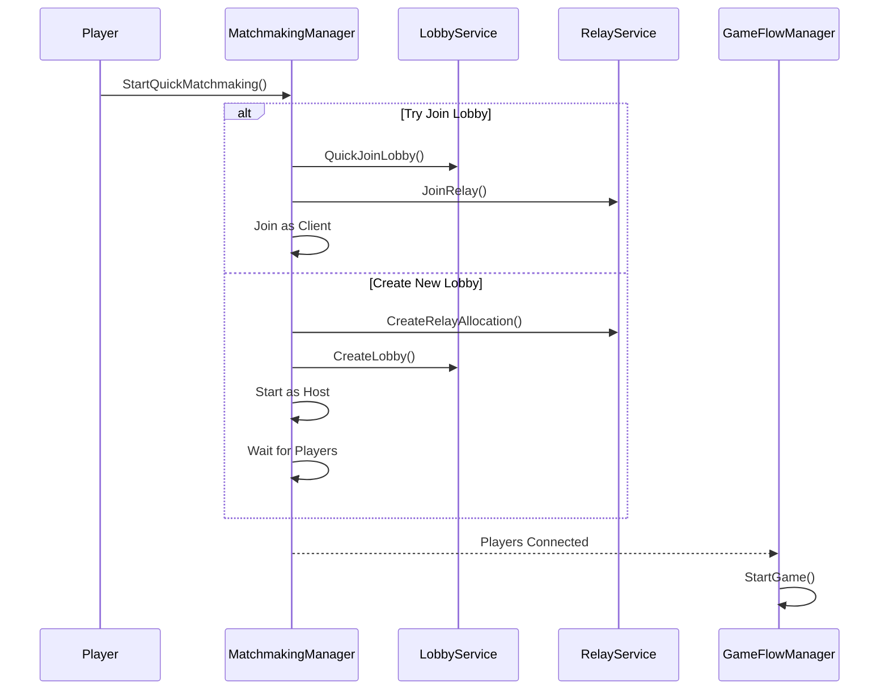
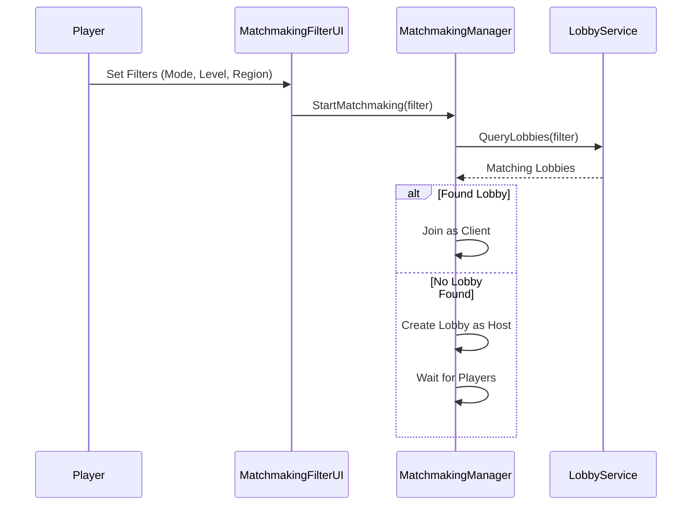
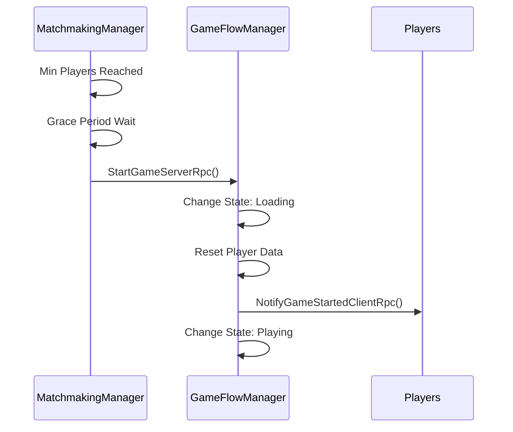
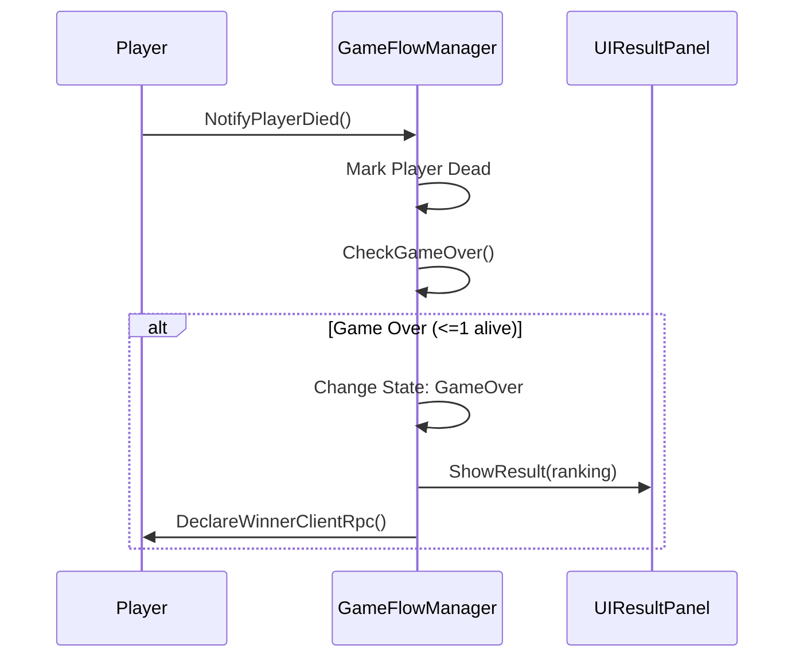
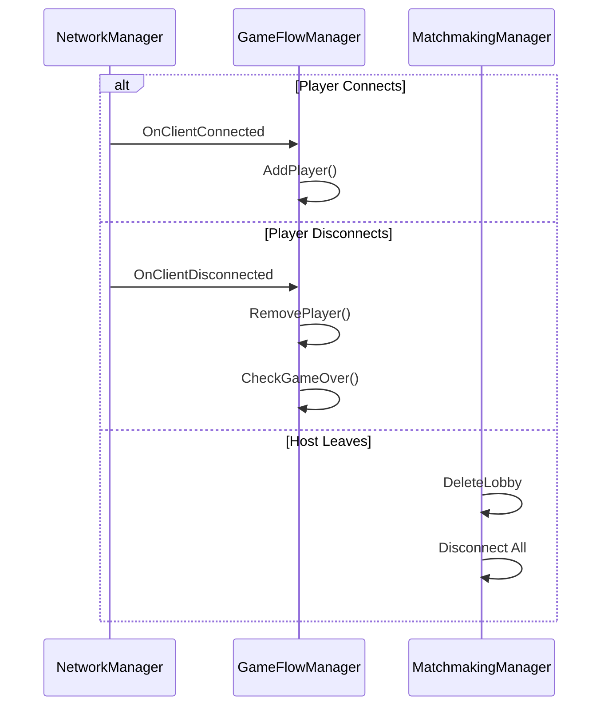
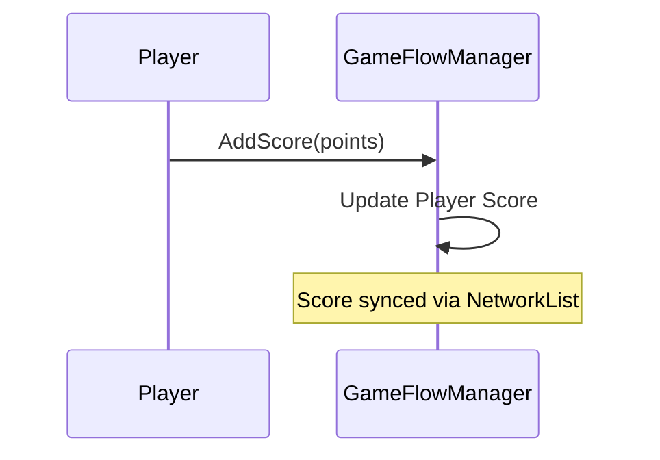
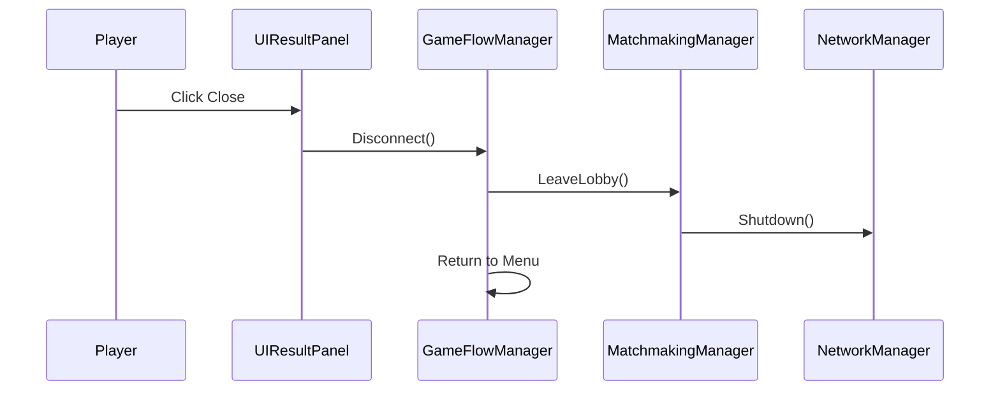

## Multiplayer System - Sequence Diagrams

### 1. Quick Match Flow

### 2. Custom Match with Filters

### 3. Game Start Flow

### 4. Player Death & Game Over

### 5. Player Connection Management

### 6. Score Update

### 7. Leave Game

