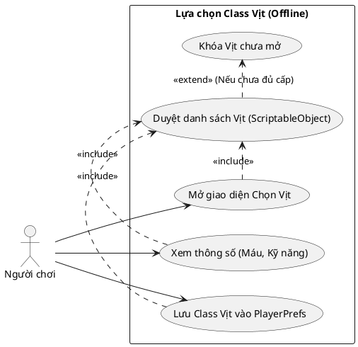
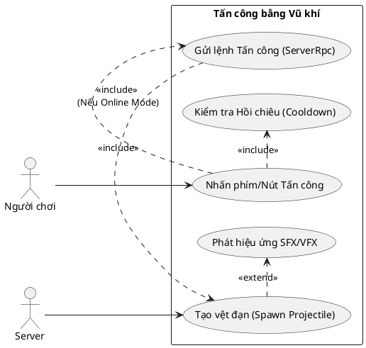
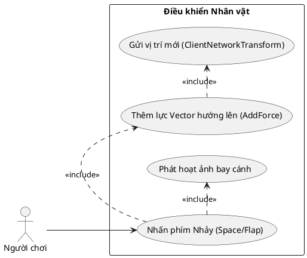
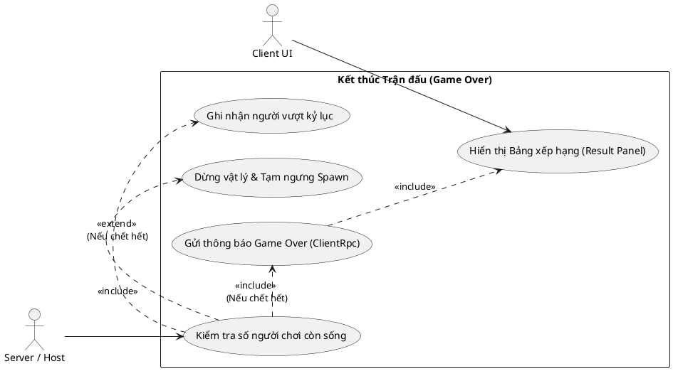
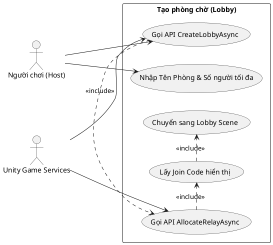
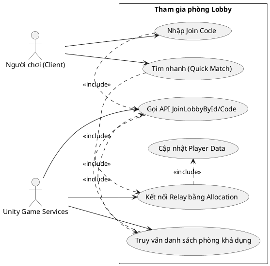
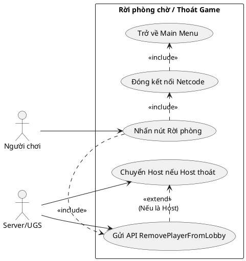
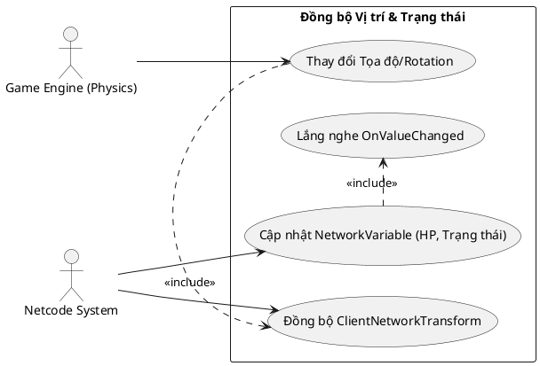
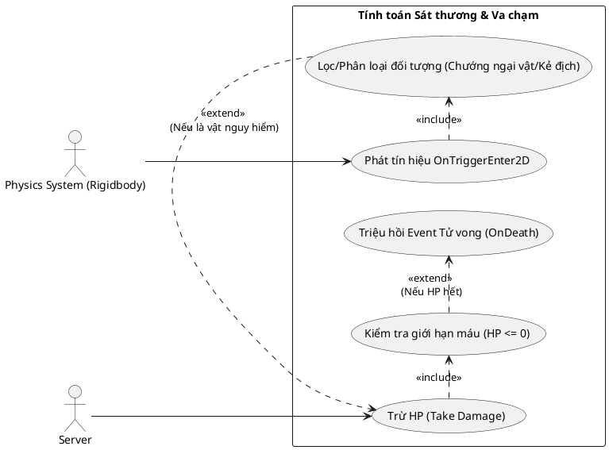
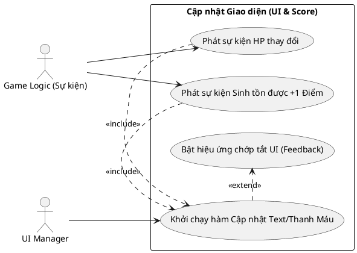

# SƠ ĐỒ USE CASE CHI TIẾT DỰ ÁN FLAPPY DUCK

Dưới đây là các sơ đồ PlantUML chi tiết bóc tách cho 10 chức năng (Use Case) cụ thể dựa trên việc phân tích mã nguồn (`GameFlowManager`, `MatchmakingManager`, `ClientNetworkTransform`,...).

1. **Lựa chọn Class Vịt**
2. **Tấn công bằng Đạn/Phi tiêu**
3. **Điều khiển nhân vật**
4. **Kết thúc trận đấu**
5. **Tạo phòng chờ**
6. **Tham gia phòng có sẵn**
7. **Rời phòng**
8. **Tự động Đồng bộ vị trí & Trạng thái**
9. **Xử lý va chạm & Tính toán sát thương**
10. **Cập nhật Điểm số & Giao diện UI**

---

### 1. Lựa chọn Class Vịt (Offline Mode)
Trong chế độ Offline/Local, người chơi truy cập danh sách Vịt từ ScriptableObject trước khi bắt đầu trận đấu.

---

### 2. Tấn công bằng Đạn/Phi tiêu
Áp dụng cơ chế tấn công vật lý, trong Multiplayer có sử dụng thao tác cấp phép từ hệ thống (ServerRpc).

---

### 3. Điều khiển nhân vật
Điều khiển thông qua Component Input kết hợp vật lý Rigidbody2D và ClientNetworkTransform.

---

### 4. Kết thúc trận đấu
Xử lý bởi `GameFlowManager` khi HP của toàn bộ Vịt về 0 hoặc bị loại.

---

### 5. Tạo phòng chờ (Create Lobby)
Xử lý bởi `MatchmakingManager`.

---

### 6. Tham gia phòng có sẵn (Join Lobby)

---

### 7. Rời phòng (Leave Lobby)

---

### 8. Tự động Đồng bộ vị trí & Trạng thái
Dựa trên `NetworkVariable` và thư viện có sẵn của Ngo.

---

### 9. Xử lý va chạm & Tính toán sát thương
Quá trình Server Authoritative khi phát hiện va chạm đạn hoặc tường.

---

### 10. Cập nhật Điểm số & Giao diện UI
Logic phản ứng (Reactive) thông qua UIManager và Observer Pattern.

